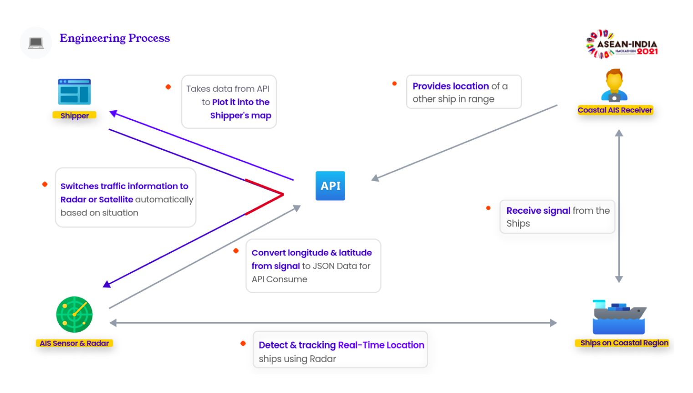

## Shipper

Traffic Management and Navigation System for Coastal Regions.
Developed for **ASEAN-India Hackathon** 2021 - PS7 by Team 51 and received **Encouragement Award**. 

### Demo

[Shipper-Web](https://shipper-web.netlify.app)


### What is Shipper ?

Shipper is a Traffic Management and Navigation System designed for Coastal Regions. This includes but not limited to docks, and regions surrounding sea shores.


### How it works



The [Server](https://github.com/NiketanG/shipper-server) acts as an AIS Station for the demo. The [Dashboard](https://github.com/NiketanG/shipper-web) utilizes the AIS Sensor & Radar on the deck for positioning. As the Coastal AIS Station transmits data, the dashboard shows and updates positions of other ships nearby.

When other ships are in close proximity, the dashboard switches to Radar for better accuracy. 

As the ships move far from coast, the connection to AIS Station is lost, the Dashboard automatically switches to Satellite Imagery for Ship Identification using [Shipper-ML](https://github.com/NiketanG/shipper-ml).

Based on locations of other ships, appropriate warnings are displayed along with Navigational Guides in case of collisions. 

A report system for unidentified ships is also implemented using the same AIS Server, and this data is transmitted to all ships in the vicinity. 

The implementation, requires no internet connectivity once connected to the AIS on Deck, as it can be converted into a standalone app running on standalone server.  


The [Pitch Presentation](Shipper_Team51_PS7.pdf) and [Demo for Shipper-ML](Shipper-ML_Demo.mp4) is included in the repo. 

---
### Local Development
##### IMPORTANT

> For Cloning, the usual `git clone` command wont work as the repo contains submodules. Use the command below.
```
git clone --recurse-submodules https://github.com/NiketanG/shipper
```

The Repo contains three modules - [`shipper-web`](https://github.com/NiketanG/shipper-web), [`shipper-server`](https://github.com/NiketanG/shipper-server) & [`shipper-ml`](https://github.com/NiketanG/shipper-ml)

- Shipper-web 
    
    Web Application to be used on the Client


- Shipper-server
    
    Mock Server used for Demo Purposes  


- Shipper-ml
    
    Object Detection ML API for Detecting Ships using Satellite Imagery


### Installation
##### Instructions for installation of each module are given in respective directories  ([`shipper-web`](https://github.com/NiketanG/shipper-web), [`shipper-server`](https://github.com/NiketanG/shipper-server) & [`shipper-ml`](https://github.com/NiketanG/shipper-ml)). 


- Install Dependencies and follow the installation procedures for all modules separately.
- Start the Shipper-server.
- Configure the Mapbox Tokens for Shipper-web. 
- Start the Shipper-Web app.
- Open [http://localhost:3000](http://localhost:3000) in your browser to view the dashboard. 


### Tech Stack
#### Open source projects used:

##### Backend:
[Nodejs](https://nodejs.org/en/)
[Expressjs](http://expressjs.com/)
[Socket.io](http://socket.io/)
[Django](https://www.djangoproject.com/)
[Postgresql](https://www.postgresql.org/)
##### Frontend:

[Reactjs](https://reactjs.org/)
[Tailwindcss](https://tailwindcss.com/)
[Mapbox](https://www.mapbox.com/)

---

## Team

- Niketan Gulekar
- Joselyn Bernabe
- Kim Vathanak
- [Edwin Ong](https://www.linkedin.com/in/edwin-ong-b43227142/)
- [Sinatrio Bimo Wahyudi](https://github.com/sinatriiobimo)


## LICENSE
[Eclipse Public License (EPL)](https://www.eclipse.org/legal/epl-2.0/)

You are free to modify the code. Redistributions are not allowed without prior request from the original author. You are obligated to include the full **license** and the **copyrights**.